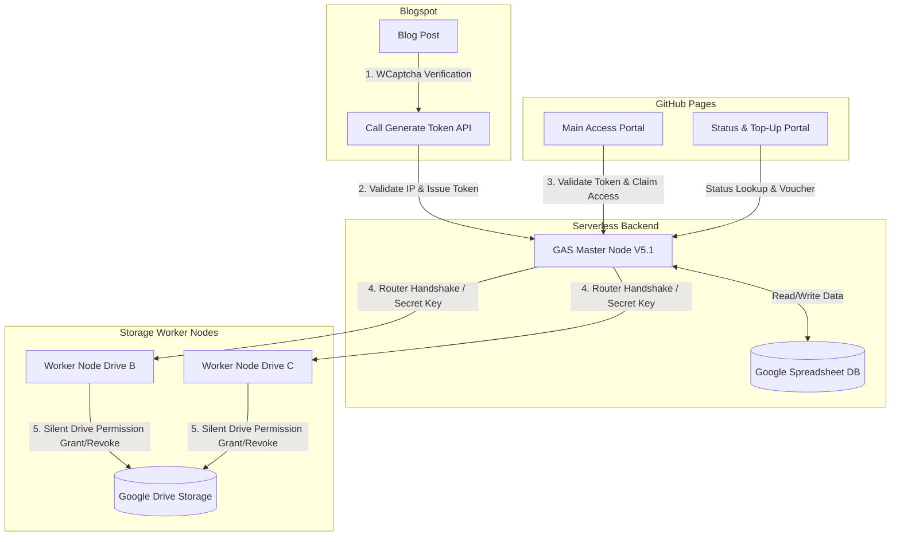

# Indonesian Visual Novel Resource Access Portal (Rynet Access System)


**Rynet Access System** is a distributed access management infrastructure built on a **Serverless Architecture** (GitHub Pages + Google Apps Script + Google Drive API). It is specifically engineered for distributing Indonesian Visual Novel and RPG archive files in a secure, automated, quota-safe, and bot-resistant environment—completely free of invasive ad-shorteners and automated scrapers.

---

## System Architecture

The architecture decouples responsibilities between the **Interactive Frontend**, the **Serverless Orchestrator (Master Node)**, and the **Drive API Executing Workers (Worker Nodes)**:



---

## Key Features

### 1. WCaptcha (Waifu CAPTCHA Gamification)
- Anime-themed gamified visual verification (*Choose Your Favorite Waifu*).
- Eliminates reliance on 3rd-party CAPTCHAs that are frequently blocked by ad-blockers or privacy extensions.
- Integrated **Behavioral Delay Guard (15-Second Timer)** to throttle automated bot scripts.

### 2. IP Defender & Retoken Rate Limiter
- **3-Tier Smart IP Detection:** Combines `ipapi.co` Token, `ipapi.co` Public, and `api.ipify.org` as fallback tiers.
- **Retoken Throttling:** Enforces a maximum limit of 6 new token requests per 24 hours per IP.
- **Automated Sanctions:** IPs detected spamming or exceeding retoken thresholds are automatically banned for 24 hours (`Log_IP_Block_Token`).
- **Honeypot Bot Trap:** Hidden trap fields to instantly identify and reject automated web crawlers.

### 3. Multi-Node Worker Router System
- Load distribution of Drive API permission grants and revocations across multiple dedicated Worker accounts (`NODE_DRIVE_A`, `NODE_DRIVE_B`, etc.) secured via **Secret Signature Keys**.
- **Silent Mode Access:** Grants *Viewer* permissions to user Gmail accounts silently (`sendNotificationEmails: false`) without cluttering their email inboxes.
- **Autonomous Cron Revocation:** Worker Nodes process expired permission revocation queues in batches via autonomous time-driven triggers every 10–15 minutes.

### 4. Free vs. Premium Access Tiers
- **Free Tier:** Limited to 3 active daily slots, 1-day (24-hour) access duration with a 3-day cooldown period. Single archive claim per cycle.
- **Premium Tier:** 15-day active period per ticket (`Master_Kode_Premium`), capped at 3 archive claims per 24 hours for storage stability.
- **Top-Up Voucher System:** Enables active period extensions via top-up voucher tokens verified directly with the admin via WhatsApp.

---

## Repository Directory Structure

```struct
├── GAS_Backend_Script_Portal.ks    # Master Node Backend Script (Google Apps Script V5.1)
├── API_Script_Drive_Worker.ks       # Worker Node Drive API Executor Script
├── Trigger_service_GAS_Portal.ks    # Time-Driven Automated Trigger for Master Node
├── Trigger_Service_GAS_Worker.ks    # Time-Driven Automated Trigger for Worker Nodes
├── portal_githubpage.ks             # Main Access Portal Frontend (GitHub Pages)
├── portal_halaman_cek_githubpage.ks # Status Checker & Top-Up Voucher Frontend
├── Postingan Blog(Wcapctha).ks      # WCaptcha Widget & Blogspot Post Script
├── Database Tabel Portal Rynet.ks   # Database Schema & 11 Table Mappings
└── README.md                        # Project Repository Documentation
```

---

## Database Schema (Google Spreadsheet DB)

The Master Node interfaces with a Google Spreadsheet Database managing 11 primary tables:

| Table Name | Primary Function |
| :--- | :--- |
| `Log_Akses` | Audit log of access grants and revocations. |
| `Log_Token` | WCaptcha token registry (Active, Burned, Expired). |
| `Log_IP_Block_Token` | Retoken frequency tracking and IP block status. |
| `Node_Registry` | Worker node registry, webhook URLs, and storage capacities. |
| `Master_Game` | Game catalog, categories, storage nodes, zip passwords, & access levels. |
| `Master_Kode_Premium` | Premium ticket registry and validity tracking. |
| `Log_Aktivitas` | User activity and system operation audit log. |
| `Blacklist` | Permanent and temporary email/IP ban list. |
| `IP_Blocked` | System-level IP security block log. |
| `Log_System_Debug` | Internal backend error and debug logs. |
| `Premium_Add_Akses` | Top-up voucher registry for access extensions. |

---

## Security & Privacy Commitments

1. **Single-Use Token Enforcement:** Every token is immediately burned upon access claim to prevent *Replay Attacks*.
2. **Client-Side Exit Defender:** Prevents accidental tab closures/refreshes during claim processing (`beforeunload`).
3. **Strict Server-Side Validation:** All input parameters (Gmail regex, ban lists, daily quotas) are re-validated on the server.
4. **Data Privacy Assurance:** User email addresses are used exclusively for Google Drive *Viewer* permissions and are never shared or published.

---

## Author & Maintainer

**Admin Rynet (Mimin Rynet)**  
*Fan Translator & Systems Architect*  
- Official Portal: [Rynet Access Portal](https://rynetsysid.github.io/portal-akses-visual-novel-bahasa-indonesia/)  
- Support & Confirmation: [Official WhatsApp Admin](https://wa.link/c9eihx)
