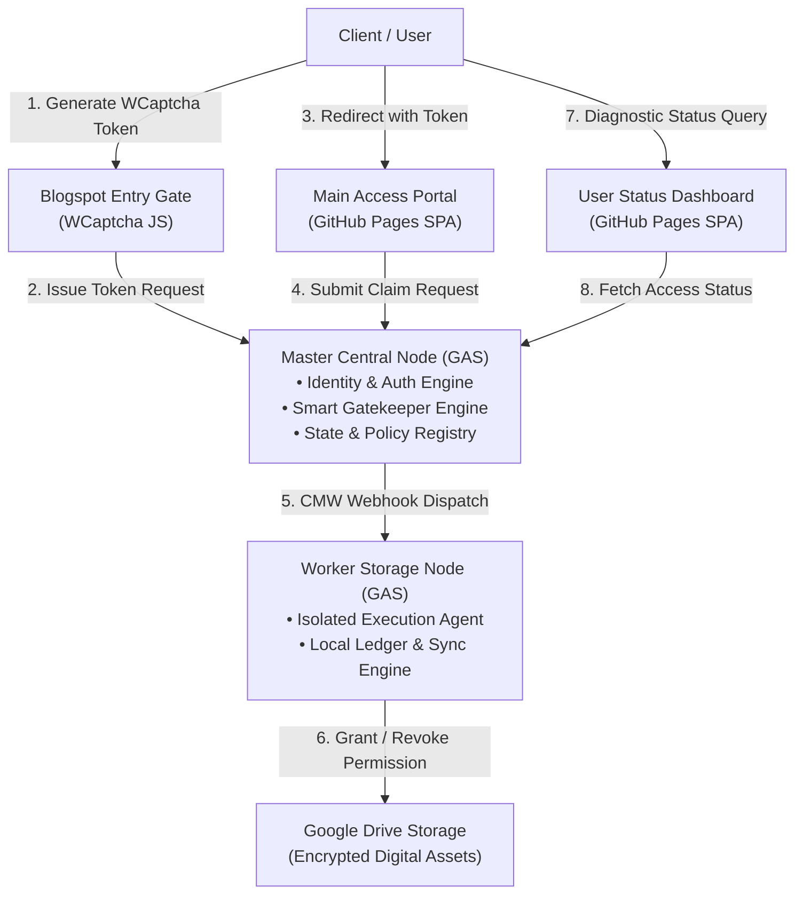
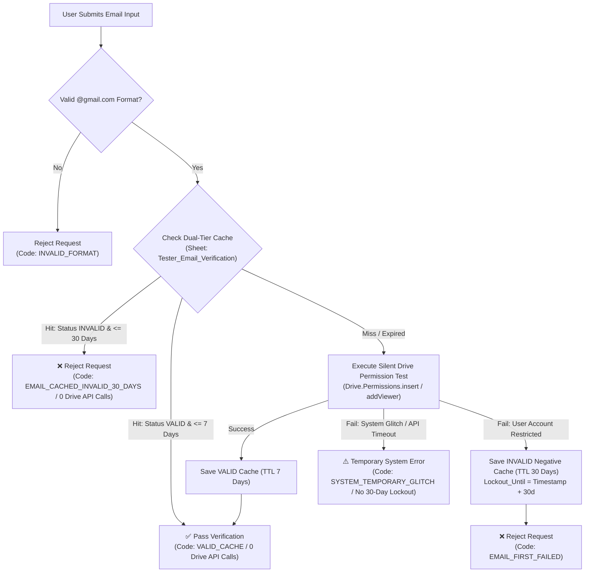
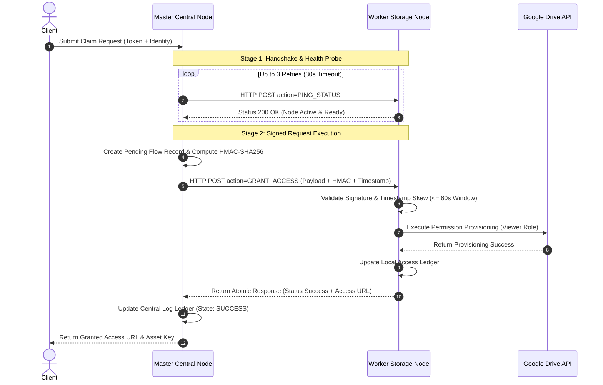
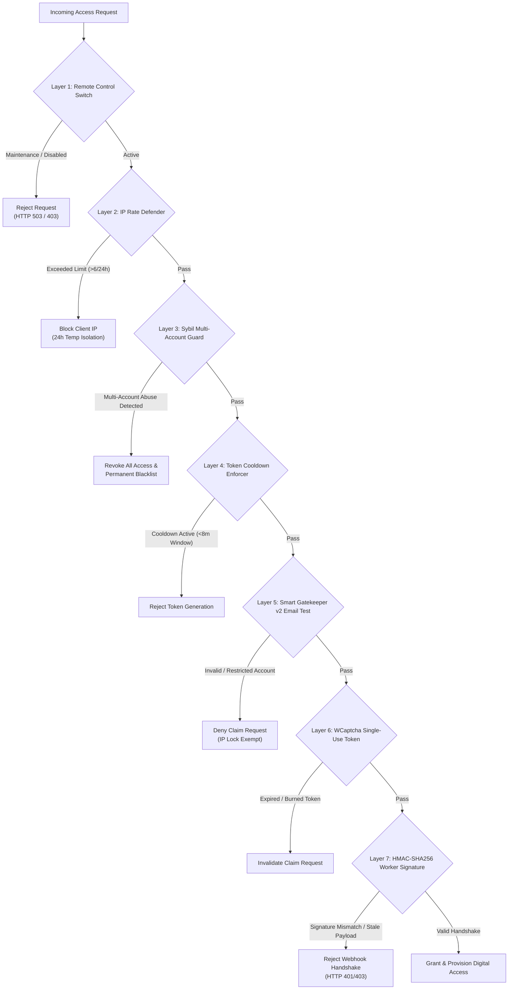
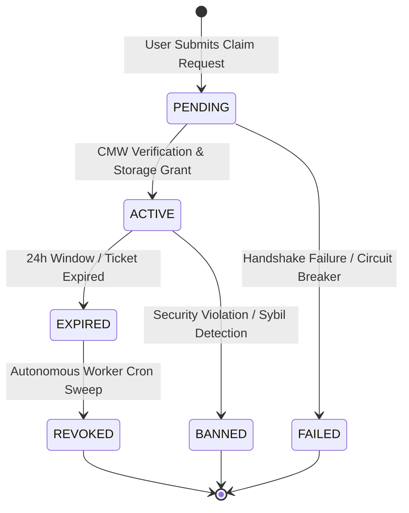
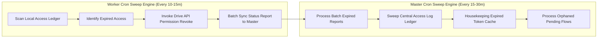

# Rynet Portal Access & Distribution System (V6.2)

An enterprise-grade, serverless **Digital Resource Distribution and Rights Management Platform** built on a distributed **Master-Worker Webhook Architecture**. The system operates as an autonomous, zero-cost, serverless infrastructure leveraging Google Apps Script (GAS), Google Drive API v2, GitHub Pages, and Blogspot to deliver secure, time-bound, and identity-bound digital asset access.

---

## Table of Contents

- [Executive Summary](#executive-summary)
- [Architectural Overview](#architectural-overview)
- [System Components](#system-components)
- [Smart Gatekeeper Email Verification Engine](#smart-gatekeeper-email-verification-engine)
- [Communication Protocol (CMW)](#communication-protocol-cmw)
- [Security Architecture](#security-architecture)
- [Autonomous Lifecycle & DRM Management](#autonomous-lifecycle--drm-management)
- [Access Tiers & Licensing](#access-tiers--licensing)
- [Infrastructure & Performance Considerations](#infrastructure--performance-considerations)

---

## Executive Summary

The **Rynet Portal Distribution System** orchestrates end-to-end access lifecycle management for large-scale digital assets. Rather than distributing physical files through risky direct download links or heavy server bandwidth, the platform acts as an **Identity-Bound Digital Rights Management (DRM)** and **Miniature Content Delivery Network (CDN)** router.

### Key Capabilities:
- **Zero-Trust Security Pipeline:** Multi-stage access validation pipeline enforcing strict IP, device fingerprint, single-use token, and HMAC-SHA256 signature verification.
- **Smart Gatekeeper v2 & Quota Defense:** Dual-tier caching engine (7-day positive / 30-day negative cache) that protects Google Drive API quotas by eliminating redundant permission requests on restricted, suspended, or invalid accounts.
- **IP Lock Exemption:** Decouples email validation failures from network IP block sanctions, ensuring legitimate users can immediately retry with alternative credentials without triggering security lockout.
- **Autonomous Lifecycle Management:** Self-executing cron engines handle automated permission provisioning, expiration enforcement, and instant access revoking without manual administrative oversight.
- **Distributed Edge Storage (Sharding):** Horizontal expansion via isolated Worker Storage Nodes, keeping storage quotas segregated and master operations lightweight.
- **Atomic Operations & Idempotency:** Guaranteed data integrity across distributed nodes with auto-rollback mechanisms upon storage provisioning errors.

---

## Architectural Overview

The system decouples **central orchestrator logic** from **storage execution**, operating under a **Master-Worker topology**.

```mermaid
flowchart TD
    User["Client / User"] -->|1. Generate WCaptcha Token| BlogGate["Blogspot Entry Gate<br/>(WCaptcha JS)"]
    BlogGate -->|2. Issue Token Request| MasterNode["Master Central Node (GAS)<br/>• Identity & Auth Engine<br/>• Smart Gatekeeper Engine<br/>• State & Policy Registry"]
    
    User -->|3. Redirect with Token| PortalSPA["Main Access Portal<br/>(GitHub Pages SPA)"]
    PortalSPA -->|4. Submit Claim Request| MasterNode
    
    MasterNode -->|5. CMW Webhook Dispatch| WorkerNode["Worker Storage Node (GAS)<br/>• Isolated Execution Agent<br/>• Local Ledger & Sync Engine"]
    
    WorkerNode -->|6. Grant / Revoke Permission| DriveAPI["Google Drive Storage<br/>(Encrypted Digital Assets)"]
    
    User -->|7. Diagnostic Status Query| CheckSPA["User Status Dashboard<br/>(GitHub Pages SPA)"]
    CheckSPA -->|8. Fetch Access Status| MasterNode
```

### CDN & DRM Architectural Analogy

1. **Origin Server & Router (Master Node):** The central controller handles authorization, licensing, abuse prevention, and node routing without processing file payload transfers.
2. **Edge Storage Nodes (Worker Nodes):** Decentralized storage workers manage actual asset permissions directly at the cloud storage layer.
3. **Identity-Bound Access (Modern DRM):** Access permissions are dynamically attached to the user's validated Google identity rather than releasing static credentials or reusable static links.

---

## System Components

### 1. Token Issuance Gateway (Blogspot Entry)
- **Role:** Primary anti-bot front door and session token generator.
- **Functionality:** Collects anonymized telemetry (client IP, device fingerprint, tab isolation ID) to issue cryptographically signed, single-use **WCaptcha Tokens** with a 1-hour expiration window.

### 2. Main Access Portal (GitHub Pages SPA)
- **Role:** Client-side interface for asset claiming (Free Tier, Premium Tier, and Gift Vouchers).
- **Functionality:** Validates dynamic tokens, monitors submission metrics, enforces human interaction delays (>2500ms), provides real-time polling on asynchronous processing status, and handles context-aware error responses via IP Lock Exemption.

### 3. User Status & History Dashboard (GitHub Pages SPA)
- **Role:** Self-service diagnostic interface for end-users.
- **Functionality:** Displays active ticket windows, remaining 24-hour quota, active storage access slots, and transaction history under strict query rate limits.

### 4. Master Orchestrator Node (Google Apps Script Backend)
- **Role:** Single source of truth and system authority.
- **Functionality:** Evaluates state policy, manages rate-limiting registers, executes remote configuration state changes, routes requests to target storage nodes, runs the Smart Gatekeeper v2 Engine, and maintains system audit logs.

### 5. Worker Storage Nodes (Google Apps Script Workers)
- **Role:** Isolated execution agents.
- **Functionality:** Executes dynamic permission provisioning (`GRANT_ACCESS`) and revoking (`REVOKE_ACCESS`) on storage repositories. Runs independent cron engines for local state sync and batch reporting.

---

## Smart Gatekeeper Email Verification Engine

The **Smart Gatekeeper v2 (`Smart_Tester_Email_Users_Verification`)** is an intelligent identity-testing module deployed on the Master Central Node. It validates whether a user's Google account is capable of receiving Drive permissions **before** attempting full resource provisioning.

```mermaid
flowchart TD
    Start["User Submits Email Input"] --> FormatCheck{"Valid @gmail.com Format?"}
    FormatCheck -->|No| InvalidFormat["Reject Request<br/>(Code: INVALID_FORMAT)"]
    FormatCheck -->|Yes| CacheCheck{"Check Dual-Tier Cache<br/>(Sheet: Tester_Email_Verification)"}
    
    CacheCheck -->|Hit: Status VALID & <= 7 Days| PassValid["✅ Pass Verification<br/>(Code: VALID_CACHE / 0 Drive API Calls)"]
    CacheCheck -->|Hit: Status INVALID & <= 30 Days| RejectCached["❌ Reject Request<br/>(Code: EMAIL_CACHED_INVALID_30_DAYS / 0 Drive API Calls)"]
    
    CacheCheck -->|Miss / Expired| DriveTest["Execute Silent Drive Permission Test<br/>(Drive.Permissions.insert / addViewer)"]
    
    DriveTest -->|Success| SaveValidCache["Save VALID Cache (TTL 7 Days)"] --> PassValid
    
    DriveTest -->|Fail: User Account Restricted| SaveNegativeCache["Save INVALID Negative Cache (TTL 30 Days)<br/>Lockout_Until = Timestamp + 30d"] --> RejectFirst["❌ Reject Request<br/>(Code: EMAIL_FIRST_FAILED)"]
    
    DriveTest -->|Fail: System Glitch / API Timeout| SysError["⚠️ Temporary System Error<br/>(Code: SYSTEM_TEMPORARY_GLITCH / No 30-Day Lockout)"]
```

### Core Architecture Highlights:

1. **Dual-Tier Caching Mechanism:**
   - **7-Day Positive Cache (`VALID`):** Successfully verified emails bypass Drive API checks for 7 days, executing instantly with 0 API overhead.
   - **30-Day Negative Cache (`INVALID`):** Accounts that fail due to Google Drive sharing restrictions, account suspensions, or parental/domain locks are cached for 30 days. Subsequent verification attempts within 30 days are rejected instantly without wasting API quota.

2. **Error Classification & System Resilience:**
   - **User Account Failures:** Hard errors (e.g., `Item dengan ID yang ditetapkan tidak dapat ditemukan`) trigger 30-day negative caching.
   - **System Glitches:** Temporary network timeouts, Google API rate limits, or script connection errors return temporary error responses **without** triggering a 30-day lockout.

3. **IP Lock Exemption:**
   - Email validation failures do **not** increment the client's IP abuse or retoken counter. 
   - Upon encountering a Gatekeeper rejection, the frontend SPA automatically re-enables and resets the email input field, allowing the user to try an alternative valid email address immediately.

4. **Context-Aware Error Messaging:**
   - **Initial Failure:** *"Email anda tidak dapat diproses. Pastikan email anda benar dan tidak sedang mengalami penangguhan/banned email. Silahkan gunakan email lainnya."*
   - **Repeat Failure (< 30 Days):** *"Email anda tidak dapat diproses. Pengecekan email anda dihitung 30 hari dari masa awal pengecekan. Silahkan gunakan email lainnya."*

---

## Communication Protocol (CMW)

The **Communication Master-Worker (CMW) Protocol** is a resilient, 2-stage asynchronous communication mechanism over HTTP POST webhooks.

```mermaid
sequenceDiagram
    autonumber
    actor User as Client
    participant Master as Master Central Node
    participant Worker as Worker Storage Node
    participant Drive as Google Drive API

    User->>Master: Submit Claim Request (Token + Identity)
    
    Note over Master,Worker: Stage 1: Handshake & Health Probe
    loop Up to 3 Retries (30s Timeout)
        Master->>Worker: HTTP POST action=PING_STATUS
        Worker-->>Master: Status 200 OK (Node Active & Ready)
    end
    
    Note over Master,Worker: Stage 2: Signed Request Execution
    Master->>Master: Create Pending Flow Record & Compute HMAC-SHA256
    Master->>Worker: HTTP POST action=GRANT_ACCESS (Payload + HMAC + Timestamp)
    
    Worker->>Worker: Validate Signature & Timestamp Skew (<= 60s Window)
    Worker->>Drive: Execute Permission Provisioning (Viewer Role)
    Drive-->>Worker: Return Provisioning Success
    Worker->>Worker: Update Local Access Ledger
    Worker-->>Master: Return Atomic Response (Status Success + Access URL)
    
    Master->>Master: Update Central Log Ledger (State: SUCCESS)
    Master-->>User: Return Granted Access URL & Asset Key
```

### Protocol Protection Features:
- **Anti-Replay Verification:** Requests with timestamp skew exceeding 60 seconds are rejected immediately.
- **Dynamic HMAC Signature:** Payloads are signed with SHA-256 using shared node secrets.
- **Idempotency Locks:** Prevents duplicate submissions by locking concurrent pending requests for the same identity window.
- **Circuit Breaker:** Stale pending requests older than 5 minutes automatically transition to a failed state to preserve system consistency.

---

## Security Architecture

The platform enforces a **7-Layer Defense-in-Depth Pipeline**. Every request must pass all validation checkpoints sequentially before access is granted.

```mermaid
flowchart TD
    Req["Incoming Access Request"] --> L1{"Layer 1: Remote Control Switch"}
    L1 -- Maintenance / Disabled --> RejectL1["Reject Request<br/>(HTTP 503 / 403)"]
    L1 -- Active --> L2{"Layer 2: IP Rate Defender"}
    
    L2 -- Exceeded Limit (>6/24h) --> RejectL2["Block Client IP<br/>(24h Temp Isolation)"]
    L2 -- Pass --> L3{"Layer 3: Sybil Multi-Account Guard"}
    
    L3 -- Multi-Account Abuse Detected --> RejectL3["Revoke All Access &<br/>Permanent Blacklist"]
    L3 -- Pass --> L4{"Layer 4: Token Cooldown Enforcer"}
    
    L4 -- Cooldown Active (<8m Window) --> RejectL4["Reject Token Generation"]
    L4 -- Pass --> L5{"Layer 5: Smart Gatekeeper v2 Email Test"}
    
    L5 -- Invalid / Restricted Account --> RejectL5["Deny Claim Request<br/>(IP Lock Exempt)"]
    L5 -- Pass --> L6{"Layer 6: WCaptcha Single-Use Token"}
    
    L6 -- Expired / Burned Token --> RejectL6["Invalidate Claim Request"]
    L6 -- Pass --> L7{"Layer 7: HMAC-SHA256 Worker Signature"}
    
    L7 -- Signature Mismatch / Stale Payload --> RejectL7["Reject Webhook Handshake<br/>(HTTP 401/403)"]
    L7 -- Valid Handshake --> Success["Grant & Provision Digital Access"]
```

> [!IMPORTANT]
> **Automated Sanction Escalation:**
> - **Token Abuse:** Exceeding issuance thresholds triggers automated 24-hour IP isolation.
> - **Sybil Attack Protection:** Multi-account abuse associated with matching device/network fingerprints results in automated access revocation and permanent blacklisting across all linked identities.
> - **Smart Gatekeeper Isolation:** Email validation failures at Layer 5 are granted **IP Lock Exemption**, preventing security false-positives while isolating unshareable Google identities.

---

## Autonomous Lifecycle & DRM Management

The platform operates on a **Stateful Identity Lifecycle**, replacing static file distributions with controlled access windows.

```mermaid
stateDiagram-v2
    [*] --> PENDING : User Submits Claim Request
    
    PENDING --> ACTIVE : CMW Verification & Storage Grant
    PENDING --> FAILED : Handshake Failure / Circuit Breaker
    
    ACTIVE --> EXPIRED : 24h Window / Ticket Expired
    ACTIVE --> BANNED : Security Violation / Sybil Detection
    
    EXPIRED --> REVOKED : Autonomous Worker Cron Sweep
    
    REVOKED --> [*]
    BANNED --> [*]
    FAILED --> [*]
```

### Self-Healing & Cron Synchronization

```mermaid
flowchart LR
    subgraph WorkerCron["Worker Cron Sweep Engine (Every 10-15m)"]
        W1["Scan Local Access Ledger"] --> W2["Identify Expired Access"]
        W2 --> W3["Invoke Drive API Permission Revoke"]
        W3 --> W4["Batch Sync Status Report to Master"]
    end
    
    subgraph MasterCron["Master Cron Sweep Engine (Every 15-30m)"]
        M1["Process Batch Expired Reports"] --> M2["Sweep Central Access Log Ledger"]
        M2 --> M3["Housekeeping Expired Token Cache"]
        M3 --> M4["Process Orphaned Pending Flows"]
    end
    
    W4 --> M1
```

1. **Worker-Side Cron Engine:** Runs periodically to inspect local permission states, execute direct storage permission revocations, and update local ledger states.
2. **Master-Side Cron Engine:** Periodically sweeps central state ledgers, synchronizes license expirations, clears stale token caches, and processes orphaned transactions.
3. **Atomic Rollback:** If storage permission assignment succeeds but local logging encounters an exception, the system triggers an emergency rollback, revoking the permission instantly to prevent untracked access leaks.

---

## Access Tiers & Licensing

The architecture supports a multi-tier entitlement structure to balance resource accessibility and platform fair use:

| Metric / Feature | Free Tier | Premium Tier | Gift Voucher Tier |
|---|---|---|---|
| **Identity Requirement** | Validated Google Account (Gatekeeper Passed) | Valid Premium Key + Linked Account | Valid Gift Code + Ex-Premium Account |
| **Active Access Window** | 24 Hours | Ticket Duration (e.g., 15 Days) | Designated Custom Window (e.g., 24 Hours) |
| **Cooldown Period** | 3 Days post-expiration | None | None |
| **Concurrency Ceiling** | Global active slot cap | Dedicated per-user asset limit | Dedicated per-user asset limit |
| **Daily Claim Quota** | 1 Asset per cycle | Up to 3 Assets per 24 Hours | Bound to designated asset |
| **Upgrade Handling** | Auto-converts Free to Expired | N/A | N/A |

---

## Infrastructure & Performance Considerations

### Why Single-Master with Decentralized Workers?
Evaluations of multi-master configurations demonstrated significant overhead due to inter-script HTTP latencies ($\approx 500\text{ms} - 1.5\text{s}$ per hop) and lock contention on shared database resources.

By maintaining a **single central orchestrator** alongside **decentralized worker storage nodes**:
- **Constant Time Routing $\mathcal{O}(1)$:** Master routes claims based on lightweight catalog mapping without carrying storage processing burdens.
- **Quota Segregation:** Storage API call limits are distributed independently across worker Google accounts, ensuring high availability and system durability.
- **Smart Gatekeeper Quota Shield:** Dual-tier positive/negative caching cuts unneeded Drive API calls by up to 90%+ for repeated access attempts.
- **Zero Operating Costs:** Fully serverless deployment requiring zero dedicated physical server footprint or recurring infrastructure overhead.

---

> *Documentation Version: 6.2 | System Architecture Standard*
